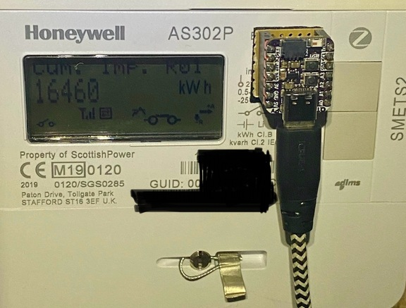
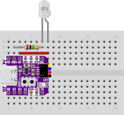
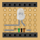

## Basic ESP32 OpenTelemetry-standards-based Sensor

### Introduction
This is a quick re-implementation of some OpenTelemetry-compatible IoT sensor work completed through 2023, but stripped back and split out as follows:
* **Main Arduino INO**: Kept as simple as possible, clearly highlighting initialisation, interrupts, setup() and loop()
* **Protobuf Creation**: The OpenTelemetry protobuf where data is stored and built-out
  * :warning: This is just a basic, monotonic, stateful counter implementation!
* **Payload Delivery**: How we send this over WiFi / OTLP / Protobuf / HTTP(S)
* **Connectivity Header**: Variables to set up WiFi, OTLP, NTP, etc
* **Minimal NeoPixel Blink**: Completely optional, but how to blink a NeoPixel using SPI (a bit of a hack) when LED_BUILTIN is not available

Here is a picture of an implementation counting blinks on a SMETS2 Smartmeter:

### Hardware Details

| Breadboard View | Veroboard View |
|-----------------|----------------|
| |  |

Notes on the hardware implementation
* This uses an [Adafruit ESP32-S2 QT Py](https://learn.adafruit.com/adafruit-qt-py-esp32-s2/overview), as it has:
  * Small footprint (20mm x 17mm), same as Seeed Xiao
  * ESP32-based - huge community around this platform
  * 802.11bgn WiFi connectivity
  * Analogue inputs for gauge usage (not exploited in this example)
  * Decent amount of memory (4MB flash, 2MB PSRAM)
  * NeoPixel can use various colours to convey status 
  * Less than 12USD to purchase
* This implementation uses a phototransistor as a switch:
  * Tested with two [Vishay Phototransistors](https://www.vishay.com/en/photo-detectors/phototransistor/): TEPT4400 (visible light) / BPW85C (visible+infrared)
  * Requires a balancing resistor (1MOhm)
* Uses the RX pin on the QT Py:
  * Same side as 3V + GND
  * Easy to cut a line across one side of veroboard to isolate the pins
  * Possible to only use resistor & phototransistor - no bridging if done correctly
  * Phototransistor can be placed centrally in veroboard

### Software Details

Some interesting detail on the implementation, that could be changed if one desires:
* Uses interrupts - debouncing may be needed in other implementations
* Send the value of the counter every 10 secs, avoiding need for rate-control
* Counter is stateful, so if there's issues with connectivity, the blanks are filled
* Only a counter is implemented - wanted to make this super-clean
* Only one attribute for resource and another for the datapoint, just for cleanliness
* [Nanopb](https://jpa.kapsi.fi/nanopb/) for Protobuf
  * Lightweight on storage and RAM, but the tradeoff is speed
  * :warning: Emphasis on the user to compile the supporting translation .c/.h files that are based on the OpenTelemetry Proto references
